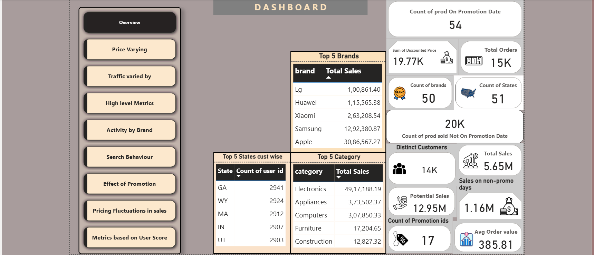

# Retail_E-commerce
# E-Commerce Sales Dashboard – Power BI

## 📊 Project Overview

This project presents an interactive **E-commerce Sales Dashboard** built using **Power BI**. It provides insights into key business metrics such as sales performance, customer behavior, and product category trends, enabling data-driven decision-making.

## 🧩 File Information

- **`Fixed_Ecomm_case_study.pbix`** – The Power BI report file containing the full dashboard and underlying data model.

## 🔍 Dashboard Features

- Dynamic visuals for:
  - Total Sales, Quantity, and Profit
  - Top-performing Products and Categories
  - Sales Trends over time
  - Regional and Segment-wise analysis
- Slicers for Year, Category, Region, and Segment filtering
- Drill-down capability for detailed insights

## 💡 Tools & Technologies

- **Power BI**
- **DAX (Data Analysis Expressions)**
- **Data Modeling**
- **Data Cleaning & Transformation**

## 📌 Purpose

This project was created to demonstrate the ability to:
- Design and build interactive dashboards
- Extract business insights from raw data
- Showcase data storytelling skills

## 🖼️ Screenshot

Below is a preview of the dashboard:

## 📬 Contact

If you have any questions or feedback, feel free to connect:

- Email: mrharshraj01@gmail.com

---

